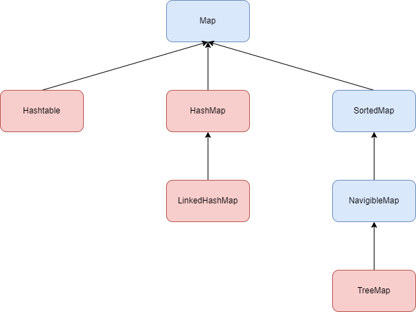

# Collections: Map
Map в Java является частью Collections Framework, но при этом не реализует interface Collections. 

## Интерфейс Map<K, V>
Map - это ассоциация ключа со значением (или пара ключ-значение), соответсвенно, когда структура Map имеет ключ K, то с помощью, например, `get(key)` мы можем получить значение V, если таковое существует. 

                    // основные методы

## Класс Hashtable<K,V>
Больше про [хэширование и хэш-таблицы](./Hashing.md)

Класс `Hashtable` в Java наследует абстрактный класс `Dictionary` и реализует три интерфейса `Map, Cloneable, Serializable`. Сам класс имеет следующую структуру: 
* `Entry<?,?>[] table` - массив элементов, содержащий данные таблицы
* `int count` - количество элементов в таблице
* `int threshold` - "порог загрузки", таблица перехэшируется, когда количетсво элементов в ней превышает этот порог. Вычисляется как `(int)(capacity * loadFactor)`
* `float loadFactor` - коэффициент загрузки таблицы
* `int modCount = 0` - значение, показывающие cколько раз эта хэш-таблица была структурно изменена. 

> Структурные модификации — это те, которые изменяют количество записей в хеш-таблице или иным образом изменяют ее внутреннюю структуру (например, перехэширование). Поле `modCount` используется для обеспечения отказоустойчивости итераторов в представлениях коллекций хэш-таблицы.

Класс `Entry<K,V>` - это внутренний класс Hashtable, который обозначает элемент (вхождение) таблицы и содержит в себе: 
* `int hash` - хэш-код ключа: `key.hashCode()`
* `K key` - ключ записи
* `V value` - сама запись
* `Entry<K,V> next` - ссылка на следующий элемент таблицы
